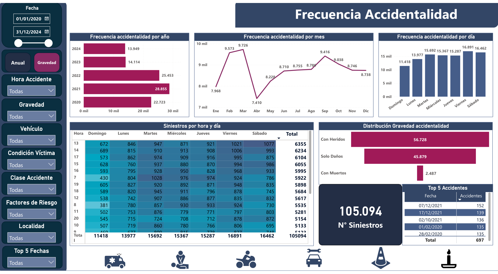
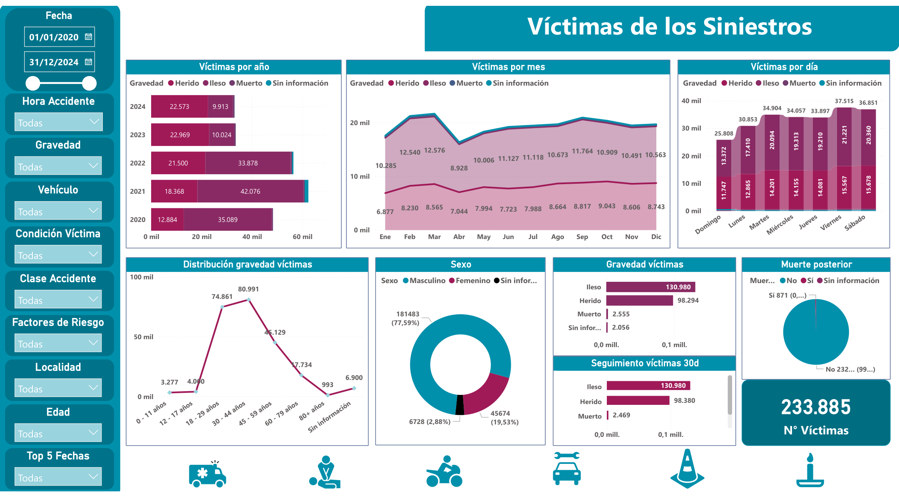
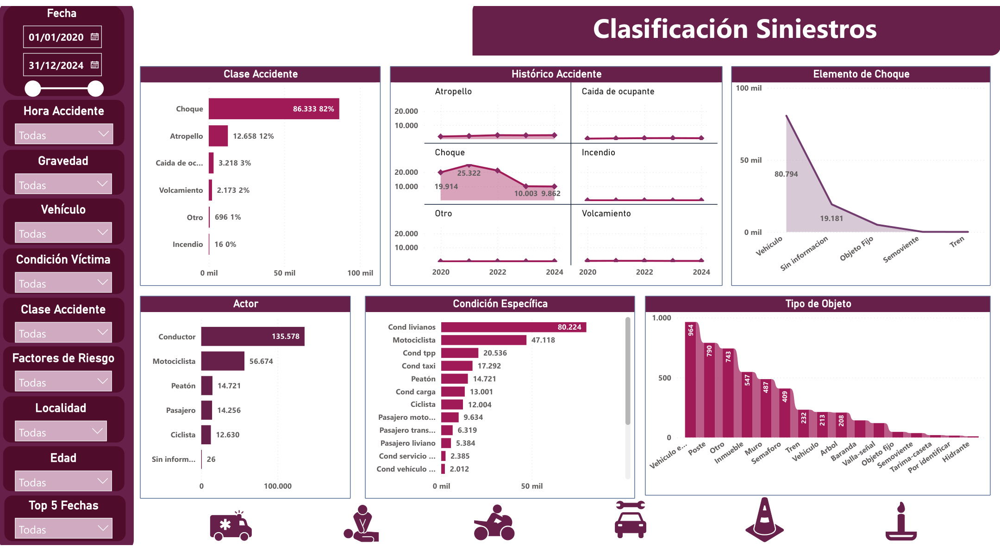
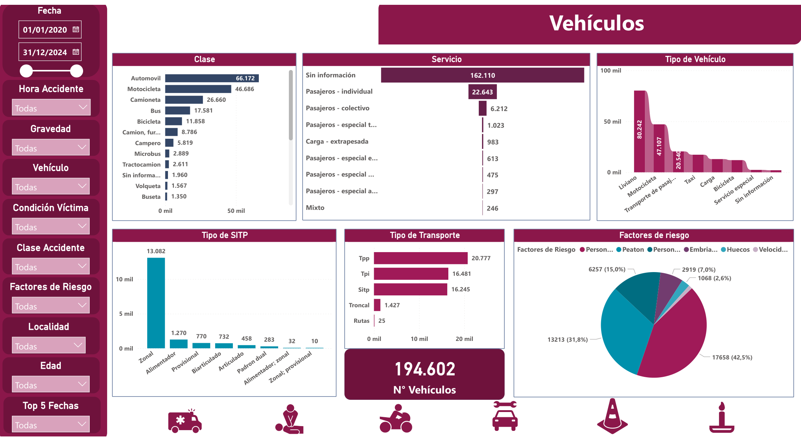
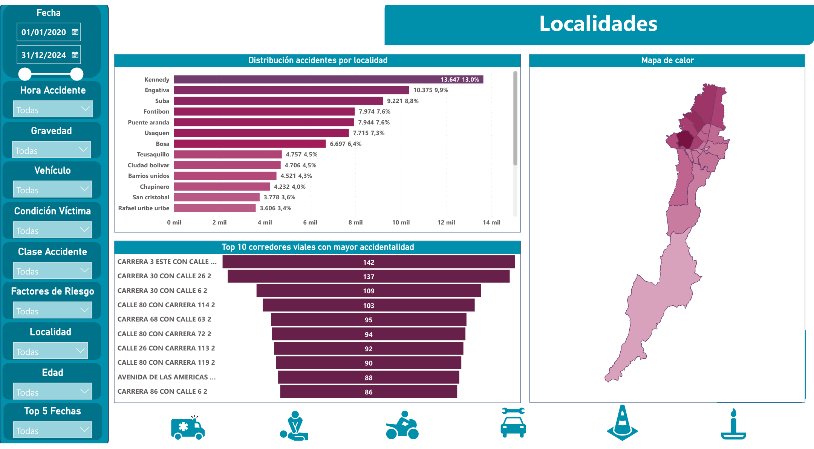
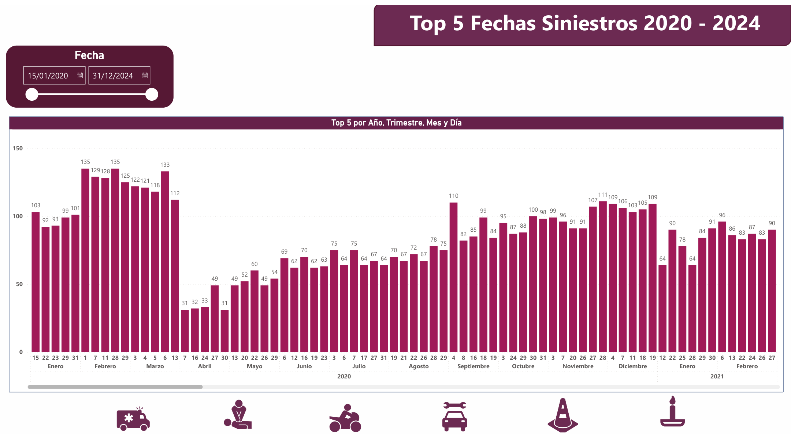

<div align="center">

# 🚦 Road Safety Analytics — Bogotá, Colombia (2020–2024)

**End-to-end data analytics project on traffic accident patterns in Bogotá using open government data**

[](https://python.org)
[](https://pandas.pydata.org)
[](https://powerbi.microsoft.com)
[](https://jupyter.org)
[]()
[](LICENSE)

</div>

---

## 📌 Overview

This project performs a **complete end-to-end data analysis** of road traffic accidents (siniestros viales) in Bogotá, Colombia between 2020 and 2024. Using open data from the Secretaría Distrital de Movilidad, the analysis spans data ingestion, multi-source cleaning and normalization, exploratory analysis, and a fully interactive Power BI dashboard for decision-support.

The goal is to identify **temporal patterns, high-risk road actors, accident severity trends, and geographic concentrations** that can inform public safety policy and urban mobility planning.

---

## 🎯 Key Questions Answered

- How have traffic accident rates evolved year-over-year from 2020 to 2024?
- Which vehicle types and road actors are most frequently involved in serious incidents?
- Are there seasonal or day-of-week patterns in accident frequency?
- How did mobility restrictions during 2020–2021 affect accident rates?
- What accident categories show the highest severity (deaths and injuries)?

---

## 🗂️ Project Structure

```
colombia-traffic-accidents-analysis-2020-2024/
│
├── 📓 01_Limpieza_HJ_Siniestros_Norm_Data.ipynb       # Accidents dataset: cleaning & normalization
├── 📓 02_Analisis_Grafico_HJ_Siniestros.ipynb          # Exploratory visual analysis
├── 📓 03_limpieza_datos_vehiculos_actorvial.ipynb      # Vehicle & road actor data cleaning
├── 📓 04_normalizacion_unificacion_datos.ipynb         # Multi-source normalization & merge
├── 📓 05_consolidacion_resultados_equipo.ipynb         # Final consolidation & team results
│
├── 📊 Siniestralidad vial Bogotá.pbix                  # Interactive Power BI dashboard
├── 📄 Siniestralidad vial Bogotá.pdf                   # Exported dashboard (PDF)
├── 📋 Siniestralidad vial Bogotá.pptx                  # Project presentation
├── 📝 Informe_Accidentes Viales en Bogota_...pdf       # Full analytical report
│
├── 📁 _Normalizacion_Base_Siniestros_.xlsx             # Normalized accidents base
├── 📁 base_anuario_de_siniestralidad_filtrado.xlsx     # Filtered annual dataset
└── 📁 Paleta de colores - proyecto.pptx                # Visual design guidelines
```

---

## 🛠️ Tech Stack

| Layer | Tool | Purpose |
|-------|------|---------|
| Language | Python 3.10+ | Core analysis engine |
| Data manipulation | Pandas, NumPy | Cleaning, transformation, aggregation |
| Visualization | Matplotlib, Seaborn | EDA charts and distribution analysis |
| BI Dashboard | Power BI Desktop | Interactive business intelligence report |
| Data formats | Excel (.xlsx), CSV | Source data ingestion |
| Environment | Jupyter Notebook | Reproducible analysis workflow |
| Version control | Git & GitHub | Collaboration and versioning |

---

## 🔄 Data Pipeline

The project follows a structured 5-stage pipeline:

```
Raw Open Data (SDM Bogotá)
        │
        ▼
[01] Cleaning & Normalization       ← Handle nulls, fix dtypes, standardize columns
        │
        ▼
[02] Exploratory Visual Analysis    ← Distributions, trends, outliers, correlations
        │
        ▼
[03] Vehicle & Actor Data Cleaning  ← Secondary dataset: vehicle types & road actors
        │
        ▼
[04] Multi-source Normalization     ← Schema alignment, key unification, data merge
        │
        ▼
[05] Results Consolidation          ← Final dataset ready for dashboard & report
        │
        ▼
Power BI Dashboard + Analytical Report
```

---

## 🧹 Data Cleaning Highlights

The raw datasets required significant preparation before analysis:

- **Multi-year consolidation:** Integrated annual accident records across 5 years (2020–2024) into a unified schema
- **Missing value treatment:** Applied column-specific strategies — median imputation for numeric fields, mode for categorical, row removal for critical nulls
- **Data type normalization:** Standardized date/time formats, encoded accident severity categories, harmonized column naming conventions across annual files
- **Duplicate detection:** Identified and removed duplicate incident records caused by multi-source ingestion
- **Secondary dataset join:** Cleaned and merged vehicle/road-actor datasets using standardized accident identifiers
- **Categorical encoding:** Normalized Spanish-language category values with inconsistent spelling across years (e.g., accented vs. unaccented entries)

---


## 🖥️ Dashboard Preview — Power BI

The Power BI dashboard provides an interactive analytical view of road traffic accidents in Bogotá between 2020 and 2024.

The report is structured into six analytical views covering **accident frequency, victims, road actors, vehicles, risk factors, and geographic distribution**.

### 📊 Dashboard Views

#### 01. Accident Frequency & Temporal Analysis

Analysis of accident frequency by **year, month, day of week, and hour**, including accident severity and the highest-accident dates.

<p align="center">
  
</p>

---

#### 02. Victim Analysis

Analysis of victims by **day, month, year, severity, age group, sex, and subsequent mortality**, providing a detailed view of the human impact of road accidents.

<p align="center">
  
</p>

---

#### 03. Accident Classification & Road Actors

Breakdown of accidents by **collision object, accident class, specific victim condition, and road actor**, highlighting the most frequently involved actors.

<p align="center">
  
</p>

---

#### 04. Vehicle Analysis

Analysis of involved vehicles by **vehicle type, SITP type, vehicle class, service category, and transportation type**.

<p align="center">
  
</p>

---

#### 05. Risk Factors & Transportation

Analysis of the main **road safety risk factors**, transportation types, and vehicle involvement across the 2020–2024 period.

<p align="center">
  
</p>

---

#### 06. Geographic Distribution

Geographic analysis of accident concentration across Bogotá, including the **top accident-prone road corridors, localities, and heatmap distribution**.

<p align="center">
  
</p>

---

### 🔎 Interactive Analysis

The Power BI report includes interactive filters for:

* 📅 Date range
* 🕐 Accident hour
* ⚠️ Accident severity
* 🚗 Vehicle type
* 👤 Victim condition
* 🛣️ Accident class
* 📍 Locality
* ⚠️ Risk factors
* 🎯 Age
* 📊 Top accident dates

> **Note:** The images above are static previews extracted from the Power BI PDF export. For the complete interactive experience, open the `.pbix` file using **Power BI Desktop**.

**Files:**

* 📊 [`Siniestralidad vial Bogotá.pbix`](./Siniestralidad%20vial%20Bogot%C3%A1.pbix) — Interactive Power BI report
* 📄 [`Siniestralidad vial Bogotá.pdf`](./Siniestralidad%20vial%20Bogot%C3%A1.pdf) — PDF export


## 📦 Data Sources

| Dataset | Source | Coverage |
|---------|--------|----------|
| Anuario de Siniestralidad Vial | Secretaría Distrital de Movilidad — Bogotá | 2020–2024 |
| Vehículos y actores viales | Datos Abiertos Colombia | 2020–2024 |

> Open data available at: [datos.gov.co](https://www.datos.gov.co) and [datosabiertos.bogota.gov.co](https://datosabiertos.bogota.gov.co)

---

## 🚀 How to Run

### Prerequisites
```bash
Python 3.10+
pip
Power BI Desktop (for .pbix file)
```

### Setup
```bash
# 1. Clone the repository
git clone https://github.com/giralrez/colombia-traffic-accidents-analysis-2020-2024.git
cd colombia-traffic-accidents-analysis-2020-2024

# 2. Create virtual environment
python -m venv venv
source venv/bin/activate        # Linux / Mac
venv\Scripts\activate           # Windows

# 3. Install dependencies
pip install pandas numpy matplotlib seaborn openpyxl jupyter

# 4. Launch Jupyter
jupyter notebook
```

### Run notebooks in order:
| Step | Notebook | Description |
|------|----------|-------------|
| 1 | `01_Limpieza_HJ_Siniestros_Norm_Data.ipynb` | Clean & normalize accidents data |
| 2 | `02_Analisis_Grafico_HJ_Siniestros.ipynb` | Exploratory visual analysis |
| 3 | `03_limpieza_datos_vehiculos_actorvial.ipynb` | Clean vehicle & actor data |
| 4 | `04_normalizacion_unificacion_datos.ipynb` | Merge & unify all sources |
| 5 | `05_consolidacion_resultados_equipo.ipynb` | Final results consolidation |

### Power BI Dashboard
Open `Siniestralidad vial Bogotá.pbix` in **Power BI Desktop** (free download from Microsoft).

---

## 📚 Deliverables

| Deliverable | File | Description |
|-------------|------|-------------|
| 📓 Analysis notebooks | `01` – `05` `.ipynb` | Full reproducible pipeline |
| 📊 Interactive dashboard | `.pbix` | Power BI report with filters |
| 📄 Dashboard export | `.pdf` | Static version for sharing |
| 📋 Presentation | `.pptx` | Executive summary slides |
| 📝 Full report | `Informe_...pdf` | Detailed analytical report |

---

## 👤 Author

**Andrés Giraldo Ramírez**
Software Engineer · Data Analytics · ML · Bogotá, Colombia 🇨🇴

[](https://www.linkedin.com/in/andres-giraldo-ramirez-a21190341)
[](https://github.com/giralrez)
[](mailto:andresras103@gmail.com)

---

## 📄 License

This project is open source and available under the [MIT License](LICENSE).

---

<div align="center">
<i>If this project was useful or interesting to you, consider giving it a ⭐</i>
</div>
